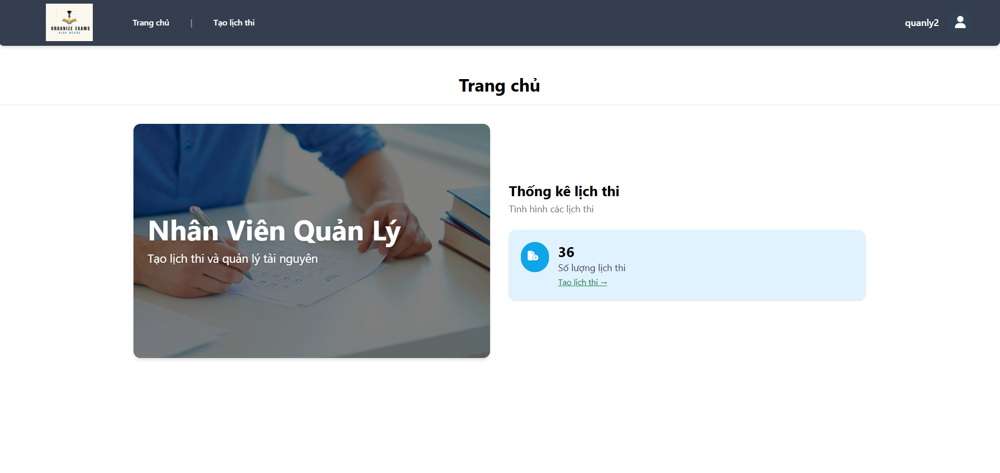
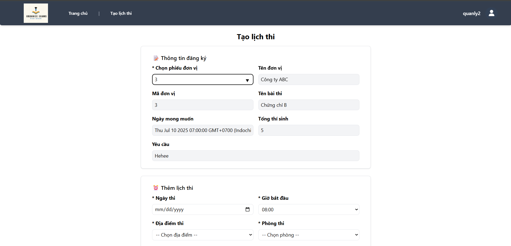
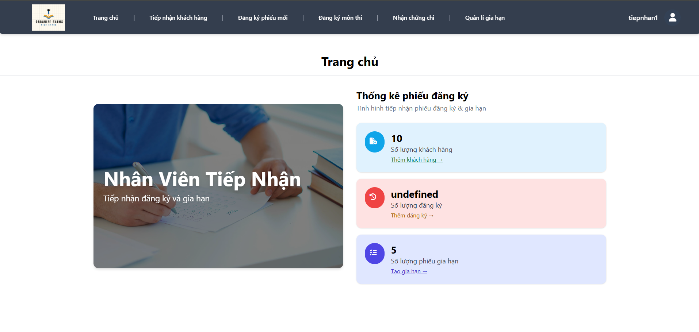
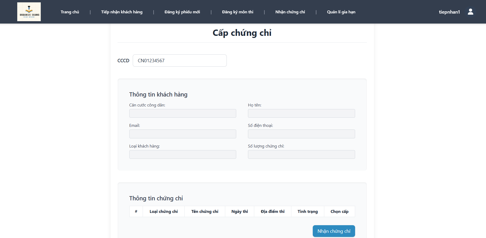
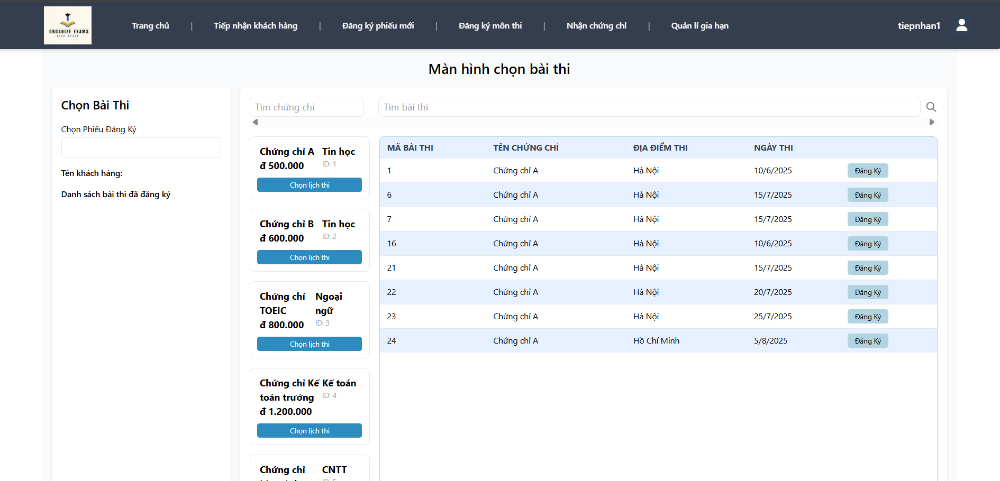
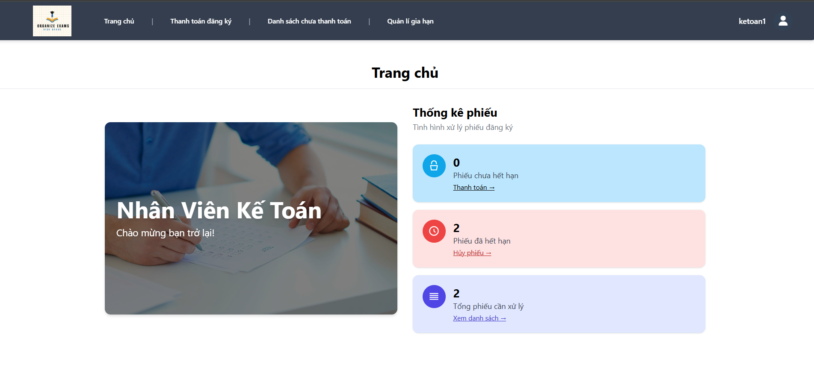
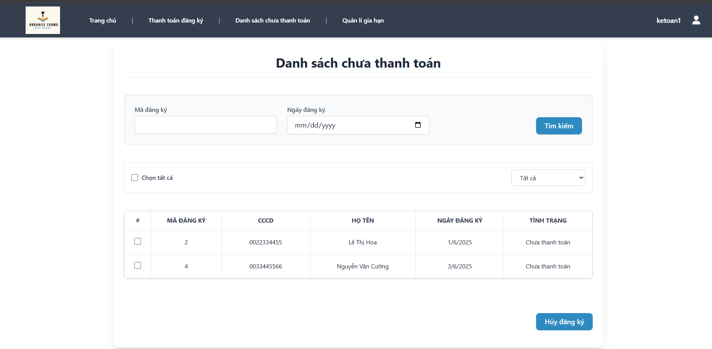
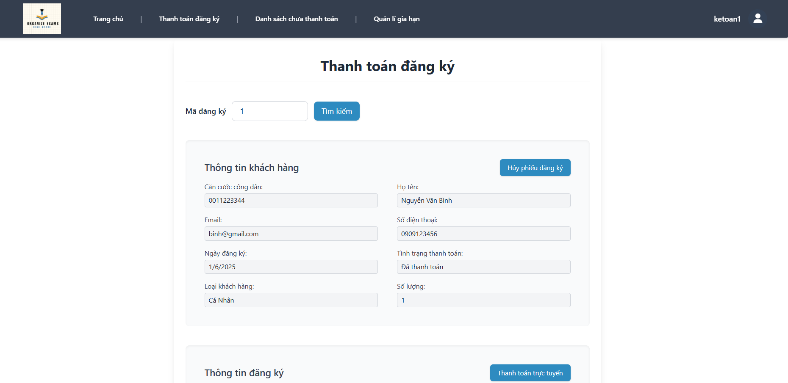

<h1 align="center">📚 Certification Center Management System</h1>

<p align="center">
  <b>Web Application to Support Exam Registration, Management, and Certificate Issuance</b><br>
  <i>Developed by a group of students from the Faculty of Information Technology</i>
</p>

---

## 📖 Introduction

Welcome to the **Certification Center Management System**! This is a comprehensive web application designed to simplify the process of registering, managing, and issuing certificates for exams. The system provides an intuitive and secure platform, serving both exam registrants and the center's management team.

---

## 🚀 Technologies

<p align="center">
  
  
  
  
  
  
</p>

---

## ✨ Key Features

The system offers a comprehensive set of powerful features for end-to-end certification process management:

* 📝 **Registration & Application Management:**
    * **Certificate Exam Registration**: Supports easy registration for both individuals and organizations.
    * **Application Management**: Efficiently review and manage exam registration applications.
    * **Application Processing**: Flexible options to cancel applications and request extensions.

* 💳 **Payment & Lookups:**
    * **Exam Fee Payment**: Integrates convenient online payment functionality (simulated).
    * **Information Lookup**: Easily view exam schedules, locations, and fees.

* 🛡️ **Certificate Management & User Roles:**
    * **Issuance Status Updates**: Meticulously manage and track certificate issuance statuses.
    * **User Role Permissions**: Customized interfaces and functionalities for each role ensure effective management:
        * 👨‍💼 **Accounting Staff**: Focuses on managing payment transactions.
        * 👩‍💼 **Management Staff**: Approves applications and oversees certificate issuance.
        * 👨‍💻 **Reception Staff**: Responsible for receiving and processing initial registration applications.
        * 🌐 **Unregistered Users**: Can look up information and perform exam registrations.
---


---

## 📸 Screenshots

The system features an intuitive interface designed for each user role:

### 👩‍💼 Management Staff Interface

<p align="center">
  
  
</p>

### 👨‍💻 Reception Staff Interface

<p align="center">
  
  
  
</p>

### 👨‍💼 Accounting Staff Interface

<p align="center">
  
  
  
</p>

---


## 📐 Project Architecture
```
CERTIFICATION-CENTER-SYSTEM/
├── src/
│   ├── config/           # Database connection configuration, environment variables
│   ├── modules/          # Contains business logic for each feature
│   │   ├── NVKT/         # Functionality for Accounting Staff
│   │   ├── NVQL/         # Functionality for Management Staff
│   │   ├── NVTN/         # Functionality for Reception Staff
│   │   └── Unlogin/      # Functionality for unauthenticated users
│   ├── public/           # Static assets (images, js, css)
│   │   ├── css/
│   │   ├── img/
│   │   └── js/
│   ├── routes/           # Module-based routing
│   │   ├── NVKT/
│   │   ├── NVQL/
│   │   ├── NVTN/
│   │   └── Unlogin/
│   └── views/            # HBS (Handlebars) templates
├── uploads/              # Directory for uploaded files (images, application forms, etc.)
├── .env                  # Environment variables for the application
├── app.js                # Application entry point
├── createTable.sql       # Database table creation script
├── package.json          # Manages dependencies and scripts
├── tailwind.config.js    # Tailwind CSS configuration
└── README.md             # Project documentation (this file)
```

---

## ⚙️ **Install & Run**:

### 1. Clone the Project

```bash
git clone [https://github.com/mrDanh11/Certification-Center-System.git](https://github.com/mrDanh11/Certification-Center-System.git)
cd Certification-Center-System
```
### 2. Install Dependencies
```bash
npm install
```
### 3. Configure .env
```bash
PORT=8080
DB_USER=your_db_user
DB_PASSWORD=your_db_password
DB_NAME=your_database
DB_SERVER=localhost
JWT_SECRET=your_jwt_secret
```

### 4. Start the Application
```bash
npm run start:dev
```
Access the application at: http://localhost:3000
---

## 📌 Notes

* The user interface is built with **Handlebars** and **Tailwind CSS**.
* Data is stored and managed by **Microsoft SQL Server**.
* The system uses **JWT (JSON Web Tokens)** to ensure secure user authentication and authorization.
* Clear role-based access control ensures each user role can only access appropriate functionalities.

---

## 👨‍💻 Team Members

* Nguyen Duc Anh
* Bui Duy An
* Vu Duy Bac
* Nguyen Chi Danh
* Nguy Thanh Dat

University of Science - Faculty of Information Technology
Academic Year 2022–2026

---

## 📄 License

This project is developed for educational purposes and internal sharing within the scope of the Web Application Development course.


